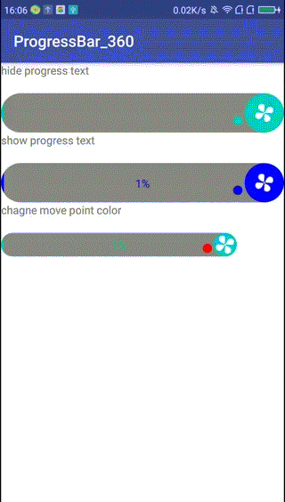

# ProgressBar_360



##ProgressBar_360的属性

###(1)设置进度条的颜色
###(2)设置背景颜色
###(3)设置进度文本的颜色
###(4)设置进度文本字体大小
###(5)设置移动小球的颜色
###(6)是否显示进度文本


## Usage
```xml
 <com.ll.progressbar.view.ProgressView
        android:id="@+id/progressView1"
        android:layout_width="match_parent"
        android:layout_height="wrap_content"
        android:layout_marginTop="20dp"
        app:movePointColor="#00cfc7"
        app:progressReachedColor="#00cfc7"
        app:progressTextColor="#00cfc7"
        app:isShowProgressText="false"
        />
